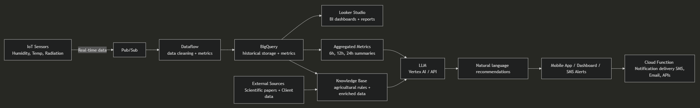

<!-- Slide 1 -->

---

# Diamond Sow Gardens
## AI Workshop

---

# Solutions Workshop Agenda

- Overview
- Use Cases
- Architecture
- Estimate
- Next Steps

---

# Overview
## About
- Diamond Sow Gardens specializes in **sustainable agriculture and research**  
- Based in New Mexico, partnered with **Los Alamos National Labs**  
- Mission: advance **organic and biodynamic farming practices** with technology  

---

# Overview 
## Current State
- 🌡️ Real-time sensor data (Ubibot, Davis Instruments) already available  
- ✅ Basic automation exists (e.g., temperature-based sidewall control)  
- ❌ Pain points:
  - No AI-based analysis  
  - Limited ability to **correlate multi-source data** (humidity, moonlight, temperature, wind)  
  - Lack of automated **report generation and recommendations**  

---

# Overview 
## Goals
- 📊 Develop **AI-driven monitoring** for plant health and production optimization  
- ⚡ Enable scheduled **trigger-based alerts and recommendations**  
- 🌿 Focus on **cucumber downy mildew prevention** (vertical POC)  
- 🤖 Build an **agentic system**: reporting → recommending → (future) automating  

---

# 🎯 Use Cases

---

# Use Cases  

- **AI Reports**  
  - Automatic interpretation of multi-sensor data  
  - Natural language summaries of plant health  

- **Predict Adverse Scenarios**  
  - Example: cucumber downy mildew  
  - Extendable to other crop stressors within defined scope  
  - Use data such as **humidity, temperature, wind, spectrometry**  
  - Early alerts → reduced crop loss  

- **Actionable Alerts (Human-in-the-Loop)**  
  - Recommendations via mobile/web  
  - Human review and approval before interventions  
  - Current POC: suggest **potassium supplementation** under defined triggers  

---

# 🏗️ Architecture

- Ingest data streams with **Pub/Sub**  
- Process with **Dataflow**  
- Store and correlate metrics in **BigQuery**  
- Generate recommendations with **Vertex AI**  
- Deliver insights via web/mobile for **human decision-making**  

---

# 📊 Estimate

## Scrum-Based Estimation
- Epics and stories summarized here  
- Full CSV provided separately  

---

# 🚀 Next Steps  

1. Confirm cucumber downy mildew dataset and triggers (humidity, temp, wind, irrigation)  
2. Define success metrics for AI reports (precision, recall, farmer usability)  
3. Build initial pipeline in GCP (BigQuery + Vertex AI + Pub/Sub)  
4. Provide textual recommendations (daily summaries or alerts)  
5. Evaluate results, refine, and extend to other crops  

---

# Thank you