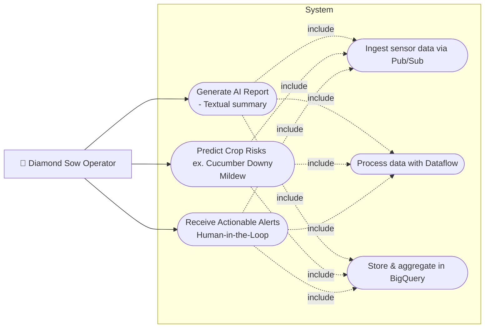
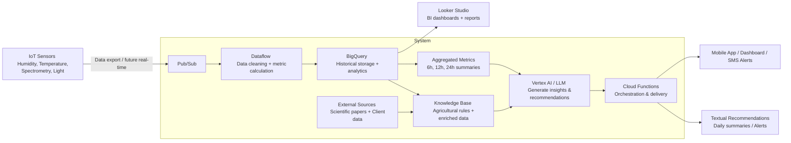
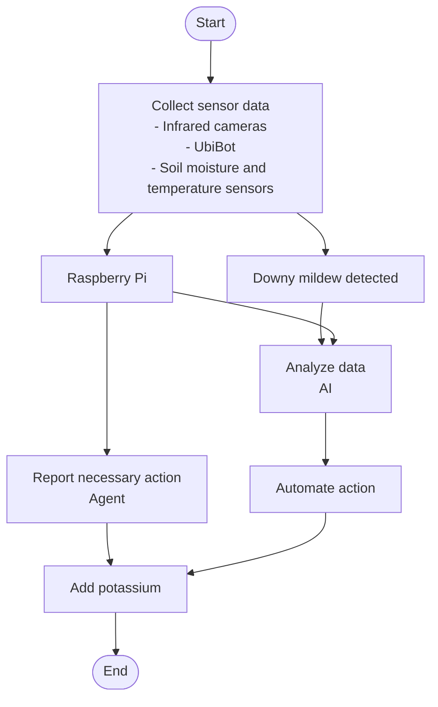

```mermaid

flowchart LR
    A[👤 Diamond Sow Operator]

    %% Agrupamos en un subgraph
    subgraph SYS[System]
        UC1([Generate AI Report <br> - Textual summary])
        UC2([Predict Crop Risks <br> ex. Cucumber Downy Mildew])
        UC3([Receive Actionable Alerts <br> Human-in-the-Loop])

        %% Subprocesses (includes)
        INC1([Ingest sensor data via Pub/Sub])
        INC2([Process data with Dataflow])
        INC3([Store & aggregate in BigQuery])

        %% Includes
        UC1 -.->|include| INC1
        UC1 -.->|include| INC2
        UC1 -.->|include| INC3

        UC2 -.->|include| INC1
        UC2 -.->|include| INC2
        UC2 -.->|include| INC3

        UC3 -.->|include| INC1
        UC3 -.->|include| INC2
        UC3 -.->|include| INC3
    end

    %% Relaciones del actor con los casos de uso
    A --> UC1
    A --> UC2
    A --> UC3


```

```mermaid
flowchart LR
    A[IoT Sensors <br> Humidity, Temperature, Spectrometry, Light] -->|Data export / future real-time| B[Pub/Sub]

    %% Subgraph para el sistema
    subgraph SYS[System]
        B --> C[Dataflow <br> Data cleaning + metric calculation]
        C --> D[BigQuery <br> Historical storage + analytics]
        D --> E[Knowledge Base <br> Agricultural rules + enriched data]
        D --> F[Aggregated Metrics <br> 6h, 12h, 24h summaries]
        J[External Sources <br> Scientific papers + Client data] --> E
        E --> G[Vertex AI / LLM <br> Generate insights & recommendations]
        F --> G
        G --> L[Cloud Functions <br> Orchestration & delivery]
    end

    %% Outputs desde Cloud Function
    L --> H[Textual Recommendations <br> Daily summaries / Alerts]
    L --> I[Mobile App / Dashboard / SMS Alerts]

    %% Complemento BI
    D --> K[Looker Studio <br> BI dashboards + reports]


```

```mermaid
flowchart TD
    A([Start]) --> B[Collect sensor data<br/>- Infrared cameras<br/>- UbiBot<br/>- Soil moisture and temperature sensors]
    B --> C[Raspberry Pi]
    B --> D[Downy mildew detected]
    D --> E[Analyze data<br/>AI]
    C --> E
    E --> F[Automate action]
    C --> G[Report necessary action<br/>Agent]
    G --> H[Add potassium]
    F --> H
    H --> I([End])
```
