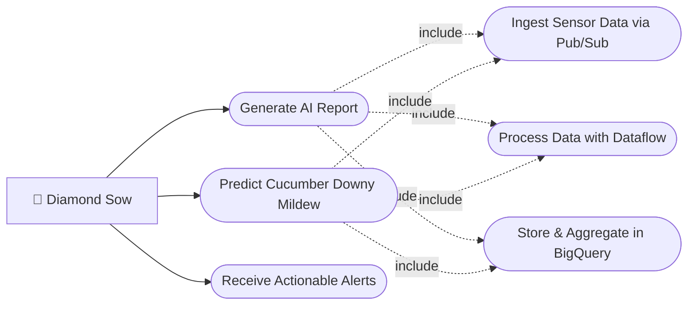
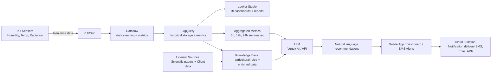

```mermaid

flowchart LR
    A[👤 Diamond Sow]

    UC1([Generate AI Report])
    UC2([Predict Cucumber Downy Mildew])
    UC3([Receive Actionable Alerts])

    %% Subprocesos internos (includes)
    INC1([Ingest Sensor Data via Pub/Sub])
    INC2([Process Data with Dataflow])
    INC3([Store & Aggregate in BigQuery])

    %% Relaciones principales
    A --> UC1
    A --> UC2
    A --> UC3

    %% Includes
    UC1 -.->|include| INC1
    UC1 -.->|include| INC2
    UC1 -.->|include| INC3
    UC2 -.->|include| INC1
    UC2 -.->|include| INC2
    UC2 -.->|include| INC3

```

```mermaid
flowchart LR
    A[IoT Sensors <br> Humidity, Temp, Radiation] -->|Real-time data| B[Pub/Sub]
    B --> C[Dataflow <br> data cleaning + metrics]
    C --> D[BigQuery <br> historical storage + metrics]
    D --> E[Knowledge Base <br> agricultural rules + enriched data]
    D --> F[Aggregated Metrics <br> 6h, 12h, 24h summaries]
    J[External Sources <br> Scientific papers + Client data] --> E
    E --> G[LLM <br> Vertex AI / API]
    F --> G
    G --> H[Natural language recommendations]
    H --> I[Mobile App / Dashboard / SMS Alerts]
    I --> L[Cloud Function <br> Notification delivery SMS, Email, APIs]
    D --> K[Looker Studio <br> BI dashboards + reports]
```

```mermaid
flowchart TD
    A([Start]) --> B[Collect sensor data<br/>- Infrared cameras<br/>- UbiBot<br/>- Soil moisture and temperature sensors]
    B --> C[Raspberry Pi]
    B --> D[Downy mildew detected]
    D --> E[Analyze data<br/>AI]
    C --> E
    E --> F[Automate action]
    C --> G[Report necessary action<br/>Agent]
    G --> H[Add potassium]
    F --> H
    H --> I([End])
```
