### Slide 1: Title
“Diamond Sow Gardens is looking to modernize agriculture with AI. Today we’ll walk you through a solution that focuses on real-time monitoring and intelligent action automation.”

### Slide 2: About
“Diamond Sow Gardens is committed to sustainable agriculture, combining traditional methods with modern technology. Our role is to help them harness AI to improve plant health and production.”

### Slide 3: Current State
“They already collect real-time data through Ubibot sensors, but they struggle to interpret multi-dimensional signals and automate decisions beyond basic temperature control.”

### Slide 4: Goals
“The main objective is to create AI systems that interpret complex data and provide actionable recommendations, starting with a cucumber mildew use case and expanding toward full automation.”

### Slide 5: Use Case 1

```mermaid

flowchart LR
    %% Actor
    A[👤 Diamond Sow]

    %% Casos de uso (en óvalos compactos)
    UC1([Receive Natural Language Reports])
    UC2([Receive Actionable Alerts])
    UC3([View Dashboards])
    UC4([Validate Disease Predictions])
    UC5([Review Scientific Data Integration])
    UC6([Ingest Sensor Data via Pub/Sub])
    UC7([Process Data with Dataflow])
    UC8([Store & Aggregate Data in BigQuery])
    UC9([Generate AI Recommendations with Vertex AI])

    %% Relaciones
    A --> UC1
    A --> UC2
    A --> UC3
    A --> UC4
    A --> UC5
    A --> UC6
    A --> UC7
    A --> UC8
    A --> UC9



```

“This POC will predict cucumber downy mildew risk based on multiple environmental factors and trigger irrigation-based potassium application when needed.”

### Slide 6: Use Case 2
“We’ll use infrared analysis to detect nutrient deficiencies early. The AI will notify agronomists with recommended organic interventions.”

### Slide 7: Use Case 3
“By analyzing Ubibot environmental data, the AI can recommend or automate greenhouse adjustments for optimal growing conditions.”

### Slide 8: Architecture
“This architecture integrates Ubibot sensors with GCP tools like Pub/Sub and BigQuery, builds AI models on Vertex AI and TensorFlow, and adds an agent layer for reporting and IoT triggers.”

### Slide 9: Estimate
“We’ll approach this project using Scrum. The plan is broken into sprints that cover integration, modeling, reporting, and POC validation.”

### Slide 10: Next Steps
“Our immediate action is to clearly define the cucumber mildew triggers and actions, integrate the data, and build the first AI prototype. From there, we validate and expand.”

