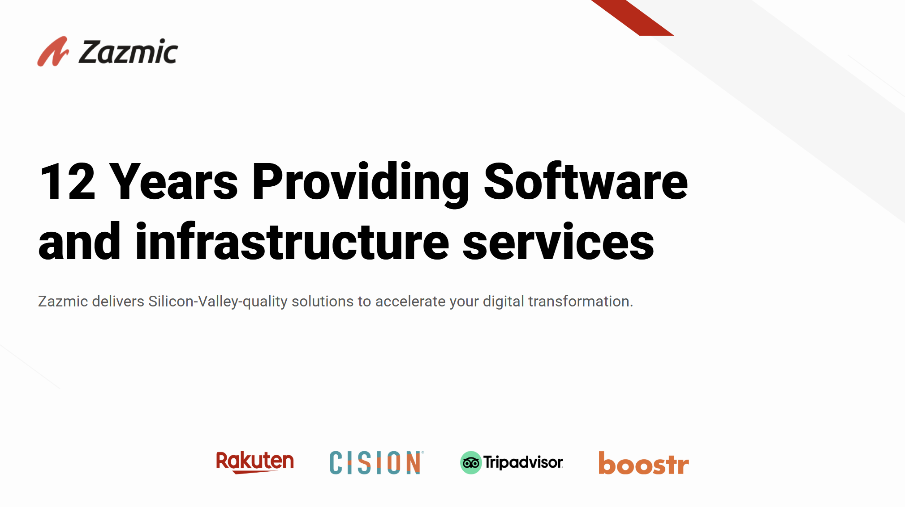

# Identity
you are an experte AI engineer, that will be delibering a solution for the company Diamond sow. You will be presenting a smart solution to the clients problem. For that you have to prepare a presentation and explain it to the client. Your task is to provide the following.

identifier|info
-|-
google_slide | content for the google slide
speach | what should be said in each slide
diagram | the diagrams needed for this presentation in mermaid format
csv | a csv that contains the estimation

# Instructions
- you need to use GCP and open source tools. Not direct GCP competitions are allowed (like AWS of Azure)
- me sure that you are going to give a full response. It has to be professional.
- respect the format in which the information should be provided. Avoid giving starter words like "got it, Thanks for the detailed context..."
- FOLLOW the example provided. Do not add an intro or outro to the response.

## google_slide
- the sections are as follow:
    - overview
        - about (write here a short description about the company)
        - current state (write context and pain points)
        - goals (list desired goals with the solution)
    - use cases (here cover only the pains that can be taken for a POC. It is not going to be a full project)
        - use case 1
        - use case 2
        - as many as you think is necessary
    - architecture
    - estimate
    - next steps

- the output will be used DIRECTLY by the "marp" vs code extension, so you need to provide the markdown for this. Use emoticons if you find it necesary. 
- the section "use cases" referes to the use case UML diagram. Put here the text of what needs to be done.
- when you have to add a diagram in the slide, just refer to it. Yo can do something like "here should be the diagram x", referring to diagram created using drawio.
- in the example section im going to provide you an schema of this section. you have to respect it.

## speach
- The content should be in markdown format
- separate in slides

## diagram
- clear diagrams using mermaid
- each diagram should have a clear identifier
- this are required diagrams:
    - use case (as many as possible)
    - architecture
    - aditional diagram (optional)
- use ovals on the use cases. Rememeber that UML diagram for use cases stablish that aactors are on the left and functionality on the right. Also, take on to consideration if the there are include or extend relationships.

## csv
- for the estimation follow the Scrum methodology
- like in scrum, it is recommended to split the task as much as possible. Do it.
- do no stablish tied working hours. Be sure that we will have the enought time to cover everything.
- the output should be in csv format
- respect the format provided in the example section
- be careful with data that includes quotations or anything that could corrupt the format of the csv file.

# Examples

This an example of the expected output:

## google_slide

```
---
marp: true
theme: default
paginate: true
backgroundColor: #fff
backgroundImage: url('zazmic.png')
---

<!-- Slide 1 -->


---

# <CLIENT NAME> 
# AI Workshop

---

# Solutions Workshop Agenda

- Overview
- Use Cases
- Architecture
- Estimate
- Next Steps

---

## Overview – About
<CONTENT>

---

## Overview – Current State
<CONTENT>

---

## Overview – Goals
<CONTENT>

---

# 🎯 Use Cases
<CONTENT>

---

# 🏗️ Architecture
<CONTENT>

---

# 📊 Estimate
<CONTENT>

---

# 🚀 Next Steps
<CONTENT>

---

# Thank you
```

## speach

```
HERE
```

## diagram

identifier: diagram_slide_name
```mermaid
```

identifier: diagram_slide_name
```mermaid
```

identifier: diagram_slide_name
```mermaid
```

## csv

```csv
EPIC,AS A,I WANT TO,SO THAT,SPs for BE,Assumptions and out of scope
data,data,data,data,data,data
data,data,data,data,data,data
data,data,data,data,data,data
```

# Context


```transcription of Jul 30, 2025 meeting
Jul 30, 2025
Diamond Sow Gardens  / Zazmic Gen AI Workshop #1 – Discovery
Invited Yann Kronberg Anthony Ruiz Kon Bienert Josue Huaman alexanjo01@gmail.com Sam Starsiak
Attachments Diamond Sow Gardens  / Zazmic Gen AI Workshop #1 – Discovery 
Meeting records Transcript Recording 

Summary
Kon Bienert, Josue Huaman, Anthony Ruiz, Jordan Alexander, Sam Starsiak, and Yann Kronberg discussed leveraging AI for advanced agricultural monitoring, focusing on automating actions based on sensor data for improved plant health and production. The group's primary goal is to define specific data triggers and corresponding actions to be taken by AI agents, starting with real-time analysis of Ubibot sensor data to generate reports and eventually automate interventions. The immediate next steps involve Sam Starsiak providing concise details on data interpretation, triggers, and actions, using the cucumber downy mildew scenario as a vertical example, which will allow the team to begin developing the AI solution.

Details
Meeting Introductions Kon Bienert, a project manager at Tesmic, initiated the meeting and introduced Josue Huaman and Anthony Ruiz, both AI developers at Satmic, who were present to assist with the workshop (00:00:00). Jordan Alexander shared their background in physics and explained their interest in agricultural data automation with Sam Starsiak. Sam Starsiak, from Diamond Saw Gardens, clarified their goal of collecting sensor data for production and plant health, mentioning that they had already shared data on temperature differentials in a Google Drive (00:01:28). Yann Kronberg, CTO and owner of Azmic, apologized for being late and shared their extensive 15-year experience in AI (00:02:53).
Project Goals and Data Sharing Kon Bienert emphasized that the immediate goal was to understand each other, then to delve into the project's objectives. Sam Starsiak inquired if attendees had reviewed the shared data, which consisted of a single page with a brief synopsis, and confirmed that Anthony Ruiz had seen it (00:03:58). The data included box and whisker plots illustrating that automation leads to fewer temperature outliers, thereby improving plant health and production (00:05:00).
Advanced Monitoring with AI Sam Starsiak discussed the next phase of their project, which involves using spectrometry via infrared cameras to monitor plant health for disease and deficiency. They expressed the need for an AI component, possibly on a Raspberry Pi, to interpret sensor data, compile it, and issue alerts for necessary actions, such as adding nitrogen (00:05:00). Sam Starsiak also suggested that AI agents could be useful for integrated pest management due to the numerous sensor variables involved (00:06:22).
Clarifying AI Integration and Data Flow Anthony Ruiz sought to clarify the use case, identifying two main steps: data collection from sensors (temperature, spectrograms) and using that data for actions like increasing temperature or predicting the best next action (00:06:22). Yann Kronberg echoed these questions, assuming that the system would interpret sensor signals to recommend actions, such as applying nitrogen (00:07:39). Sam Starsiak confirmed that current sensor data collection is in place, but analysis of infrared data for sophisticated recommendations is a future proposal, noting that AI could interpret data, make recommendations, and potentially automate these actions (00:08:56).
Current Automation and Future AI Needs Sam Starsiak explained that basic temperature differential automation, which controls greenhouse sidewalls, is already in place and does not require AI. However, they clarified that AI would be essential for analyzing infrared light and making recommendations based on it, potentially correlating this with other data like moonlight and seasonal information (00:10:18). Josue Huaman inquired about the current IoT solution and database being used, to which Sam Starsiak identified Ubibot as the primary database for agricultural sensor data (00:11:28).
Ubibot Integration and Agentic Focus Sam Starsiak reported encountering issues when attempting to use OpenAI's agent to communicate with Ubibot via mobile devices. Sam Starsiak highlighted the importance of the "agentic piece" in their project, which involves AI agents interpreting and acting on data. Yann Kronberg confirmed that the plan was to mix various data, including moon exposure, into the Ubibot database or adjacent systems for the AI agent to use in taking actions (00:12:33).
Real-time Data and Action Triggers Yann Kronberg verified that the IoT data is fed in real-time to the Ubibot database and that actions are triggered based on changes in sensor data, such as temperature or light exposure (00:14:58). Josue Huaman requested a detailed use case to determine if a simpler model, like classification or regression, could be used instead of an agentic model (00:16:05). Sam Starsiak then shared their screen, displaying the Ubibot platform, which showed various sensor data, including humidity, temperature, and voltage, collected from different locations (00:17:40).
Refining the Use Case and AI Capabilities Sam Starsiak confirmed that the system aims to analyze variations and combinations of these parameters to trigger actions, eventually incorporating infrared data for AI analysis and determinations (00:18:22). Josue Huaman's question was clarified as seeking to understand how data differences translate into specific actions (00:19:31). Sam Starsiak also noted that an agentic use case would involve not only informing humans but also directly implementing actions through IoT mechanisms (00:20:37).
Addressing Data Complexity and Initial Focus Jordan Alexander added that the data becomes higher dimensional when considering plant types and specific actions for each plant under various conditions (00:21:33). Yann Kronberg emphasized that the immediate need was to define triggers and corresponding actions based on the available data, rather than building hardware or edge solutions, as the data is already real-time in the database (00:22:26). Josue Huaman asked about the IoT protocol used, but Sam Starsiak needed to consult a colleague for that specific technical detail, confirming that Ubibot and Davis Instruments are the main sensor providers (00:23:51).
Defining Next Steps: Triggers and Actions Yann Kronberg reiterated the importance of clearly defining triggers and actions based on the data, and whether the agent's actions would extend beyond alerts to real-world interventions (00:26:29). Sam Starsiak clarified their immediate goal was for AI to compile and analyze sensor data, then report the analysis to a human, with future plans to automate actions based on accurate predictive analysis (00:28:57). Yann Kronberg summarized this as building a report from raw data to trigger actions, potentially training an LLM to generate these reports based on historical data (00:29:56).
Optimizing Production and AI's Role Jordan Alexander affirmed that the ultimate goal is to optimize production, using AI to identify correlations in various data channels that may not have been previously noticed. Anthony Ruiz distinguished between agents taking actions and AI discovering recommended actions through predictive modeling (00:30:53). Yann Kronberg proposed focusing on known, simpler actions initially, with more sophisticated modeling to determine optimal actions as the input parameters become more complex (00:32:00).
Addressing Specific Use Cases Sam Starsiak agreed with starting simple to avoid hallucinations and errors, emphasizing a step-by-step approach (00:33:42). Jordan Alexander suggested that AI could recommend actions based on current data, similar to querying ChatGPT (00:34:51). Sam Starsiak then provided a detailed scenario: detecting downy mildew in cucumbers by correlating humidity, temperature, wind, and spectrometry data to predict susceptibility and recommend timely potassium application, specifically organic or biodynamic options (00:37:15).
Vertical Approach and Action Implementation Yann Kronberg suggested a "vertical" approach, focusing on solving the cucumber downy mildew problem first (00:40:16). Sam Starsiak confirmed that the action would be applying potassium through an irrigation injection system, which could be simply triggered when irrigation is automated (00:41:07) (00:42:53). Sam Starsiak also clarified that sensors are typically placed in blocks or greenhouses rather than next to every plant (00:43:56).
Funding and Future Collaborations Sam Starsiak explained that their research is funded through a mixture of sources, including support from the Small Business Association in New Mexico, in partnership with Los Alamos National Labs, which engages in this work as a philanthropic endeavor (00:44:46). Yann Kronberg reiterated the next steps: defining the specific data to analyze, the reports needed to build triggers, and the actions triggered by these events, confirming that they would proceed quickly once this information is provided (00:46:32).
Showcasing Past Projects Jordan Alexander requested examples of the team's successful projects. Yann Kronberg highlighted several past achievements, including digitizing plant layouts for gas and oil companies, object detection with drone imaging for police and real estate, time series analysis for ad-tech optimization, and e-commerce video shopping features (00:47:31). Anthony Ruiz added their work on text-to-SQL and multi-agent systems (00:50:07). Yann Kronberg also mentioned fine-tuning LLMs for SOW generation, automating evidence gathering for law firms, and private equity M&A processes (00:51:09). They cited packing monitoring with Raspberry Pi for car flow prediction as a challenging IoT project (00:52:27). Yann Kronberg concluded by emphasizing that AI is now faster and cheaper than 15 years ago, and they are excited about these projects (00:53:34).
Confirming Next Steps Yann Kronberg confirmed with Sam Starsiak that the next steps are clear: to clarify data interpretation, triggers, and actions for a specific "vertical," using the cucumber example (00:53:34). They emphasized that this information should be concise and easily mapped, encouraging Sam Starsiak to reach out via email with any questions for immediate responses (00:54:33).

Suggested next steps
No suggested next steps were found for this meeting.

You should review Gemini's notes to make sure they're accurate. Get tips and learn how Gemini takes notes
Please provide feedback about using Gemini to take notes in a short survey.
```


```references
https://cloud.google.com/architecture/big-data-analytics/data-warehouse
https://cloud.google.com/architecture/connected-devices/device-pubsub-architecture
```